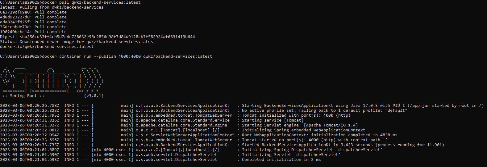
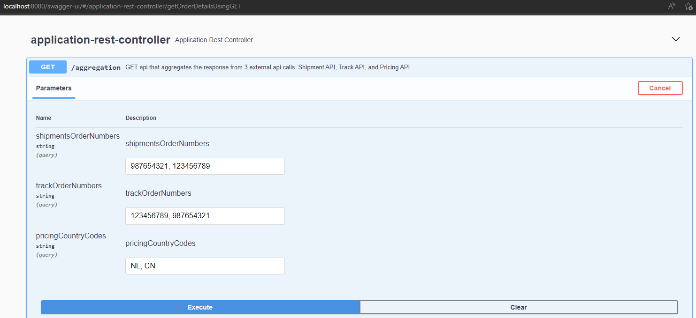
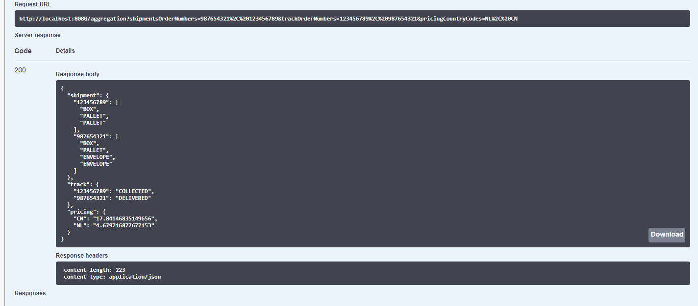

# Aggregation Service API

This aggregator api service calls 3 external api mainly :
* Shipments API 
	* Sample request `http://localhost:4000/shipment-products?orderNumber=987654321,123456789`
* Track API
	* Sample request `http://localhost:4000/track-status?orderNumber=987654321,123456789`
* Pricing API 
	* Sample request `http://localhost:4000/pricing?countryCode=NL,CN`

The calls to these 3 external api will happen asynchronously (parallel). Then the response from these 3 will be collected and aggregated to one single JSON response.

An `/aggregation` api endpoint will be exposed to accept list of query parameters corresponding to parameter values needed to call 3 apis above.

A sample request will look like this : 

`http://localhost:8080/aggregation?shipmentsOrderNumbers=987654321,123456789&trackOrderNumbers=987654321,123456789&pricingCountryCodes=NL,CN`

## Getting Started

## Step 1: Import the project to Spring Tool Suite IDE
* This project be easily imported as maven project to an IDE like STS - Spring Tool Suite by going to ``` File -> Import -> Maven -> Existing Maven Projects -> navigate to the root folder of this project -> click 'Select Folder' button ```
* Run the program in STS or execute the command ```mvn clean install``` in command line from root folder of project
  The application will run in port ```8080```

#### Step 2: Pull docker image from https://hub.docker.com/r/qwkz/backend-services/tags

#### Step 3: Enter the command in your terminal

`docker container run --publish 4000:4000 qwkz/backend-services:latest`

After running that command, it will look something like this.

  

### Prerequisites
* Java (JDK, JRE)
* An IDE such as Spring Tool Suite should suffice


### Installing

After importing the project to STS, run a `maven clean install`


## Running API tests in Swagger

Testing the api can easily be done by going to `http://localhost:8080/swagger-ui/#/application-rest-controller` after starting the program in STS.

Sample Request in Swagger




Sample Response in Swagger




## Deployment

There are 2 options to consider when deploying the app.
1. Deploy packaged aggregation-service.jar file. 
2. Deploy as a Docker Image file.
   (A `Dockerfile` was included in the root folder of this project. A docker image can be built from a `Dockerfile`).
   
#### Building the Docker image (Optional) 
* Build the ```.jar``` file of the spring boot application
* Go to root folder of the application where `Dockerfile` is saved
* Enter the command below in your command prompt or terminal.

      docker build -t aggregation-service-docker:aggregation-service

## Built With

* JDK 11 - Java version used
* [Maven](https://maven.apache.org/) - Dependency Management
* [Spring Webflux](https://docs.spring.io/spring-framework/docs/current/reference/html/web-reactive.html) - Asynchronous web framework 

## Author

* **John Ferdinand Antonio** - *Initial work for assessment purposes* 

## License

This project is licensed under the MIT License - see the [LICENSE.md](LICENSE.md) file for details

